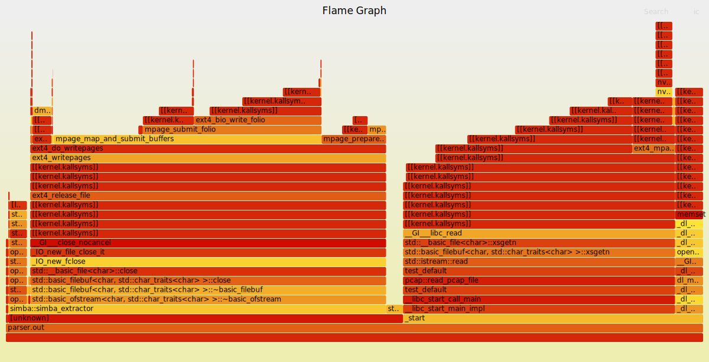

README
======
So I did this project a while ago for the take home exercise of a High Frequency Trading (HFT) firm.
I had to write a PCAP parser, which would extract SIMBA messages and convert these to JSON.
Since this was a HFT I payed special attention towards performance.

## Implementation
Since we are dealing with large blobs of binary data, and performance is of the matter.
We use packed struct punning in order to quickly make sense of large blobs of binary data.

We start by reading the entire PCAP file into memory, in a single file read.
We then start to process/parse this by keeping non owning pointer references to this large binary blob.
And masking/punning padded structs over the data.

### Mixed endianess
So a big issue in this approach is that some networking protocols use big endian.
Since Intel, AMD and ARM CPU's use little endian we need to account for this.

As when we use struct punning some fields byte order might be reversed.
So I wrote a function called `be2native()`:
```cpp
/*!
 * Network protocols are usually big endian, convert to native endian if needed.
 * @note: Function name is short for `Big Endian to Native`.
 */
template <typename T>
inline constexpr auto be2native(const T t_int) -> T {
  using std::endian;

  T result{t_int};

  if constexpr (endian::native == endian::little) {
    result = std::byteswap(t_int);
  } else if constexpr (endian::native != endian::big) {
    // TODO: Error handle, unhandeld endianess.
  }

  return result;
}
```

Now I kind of assume that the native endian format is little endian.
Since big endian is only really common in more niche systems.
Which I do not expect to support C++23 at all.

But I do assert at compile time that the system we are compiling for is little endian:
```cpp
  // Edge case but it is good to account for this.
  constexpr bool is_little_endian{endian::native == endian::little};
  static_assert(
      is_little_endian,
      "The parser currently only supports systems using little endian.");
```

The usage is quite simpel, any big endian field must go through this function.
```cpp
auto payload_is_ipv4(const Ethernet2Frame& t_frame) -> bool {
  bool result{false};

  // Normally I would make this an enumeration but I have time constraints.
  constexpr u16 ipv4_ether_type{0x0800};

  // Must convert from big endian.
  const u16 ether_type{be2native(t_frame.m_header->m_ether_type)};
  result = (ipv4_ether_type == ether_type);

  return result;
}
```

### Big endian system support
In order to support big endian systems I would just need to write a `le2native()` function.
Which does the exact opposite.
Since is use `if constexpr()` statements, the compiler would be able to decide which branch to take at compile time.

## How to compile
How to run the project:
```bash
bash test/download.sh
cd src/ && make
./parser.out
```

The `parser.out` binary default runs on the `.pcap` files downloaded by `test/download.sh`.
Please compile and run on a little endian system.

I validated the JSON files by running them through `jq`, with the basic filter:
```
$ jq . <JSON file>
<No errors>
```

This is just to confirm then I did not make any mistakes in the formatting of the JSON.

## Performance and profiling
### Lazy profiling
So I did some lazy profiling using just the `time` command:

```
$ time ./parser.out
No arguments given running defaults.
file: ../test/2023-10-09.1849-1906.pcap, packets captured: 2637416
file: ../test/2023-10-09.2349-2355.pcap, packets captured: 1133958
file: ../test/2023-10-10.0439-0450.pcap, packets captured: 1783642
file: ../test/2023-10-10.0845-0905.pcap, packets captured: 4294773
file: ../test/2023-10-10.0959-1005.pcap, packets captured: 1855725
file: ../test/2023-10-10.1359-1406.pcap, packets captured: 1388173
file: ../test/2023-10-10.1849-1906.pcap, packets captured: 2656226
./parser.out  10.31s user 3.98s system 88% cpu 16.137 total
```

Overal the program took 10 seconds.
This is not bad as this is 7.470G of data:

```
$ ls -lh test/
-rw-rw-r-- 1 user user 1.4G Oct 11  2023 ../test/2023-10-09.1849-1906.pcap
-rw-rw-r-- 1 user user 556M Oct 11  2023 ../test/2023-10-09.2349-2355.pcap
-rw-rw-r-- 1 user user 843M Oct 11  2023 ../test/2023-10-10.0439-0450.pcap
-rw-rw-r-- 1 user user 1.9G Oct 11  2023 ../test/2023-10-10.0845-0905.pcap
-rw-rw-r-- 1 user user 696M Oct 11  2023 ../test/2023-10-10.0959-1005.pcap
-rw-rw-r-- 1 user user 675M Oct 11  2023 ../test/2023-10-10.1359-1406.pcap
-rw-rw-r-- 1 user user 1.4G Oct 11  2023 ../test/2023-10-10.1849-1906.pcap
```

This means we process roughly 724.539M of data per second.
This is really good performance, but note that we do not extensively process most of the fields.
In the networking part, we just skip through those as quickly as possible to start processing/parsing SIMBA messages.

## Perf profiling
Lets also do some more extensive profiling, using the sampling profiler `perf`.
```
# Sample profile the program.
$ sudo perf record -F 999 --call-graph dwarf -- ./parser.out

# Create a flamegraph from the perf.data.
$ perf script | ~/Projects/Git/Public/FlameGraph/stackcollapse-perf.pl | ~/Projects/Git/Public/FlameGraph/flamegraph.pl > perf.svg

# Text report of the profiling.
$ perf report --stdio > perf.report
```

This generates the following flamegraph:



This flamegraph also shows us how much time is spent in various system level functions.
In order to create a flamegraph of just the time spent in various functions within the binary.
We can add the `--all-user` flag to `perf record`.
This generates the following svg:


## Callgrind analysis
Lets also run `callgrind` on the binary to get report of how many clock cycles each function costs.

```
$ valgrind --tool=callgrind  ./parser.out
```

Now lets view the callgrind output using `kcachegrind`:
```
$ kcachegrind callgrind.out.198304
```

Here we get a nice graph of all the calls and how much clock cycles each call costs.


We spend by far most of our time dealing with disk IO.

Lets analyze where we spend the most time in our program.
We do this by grouping on `ELF Object` and then selecting `parser.out` and then sorting on self.
This will show us where we spent the most time in the function itself, discounting callee's.


We spend the most time of our time in the SIMBA extraction/parsing functions.
It is not really a surprise we spend a ton of time here.
As this is the main domain logic or our project.
